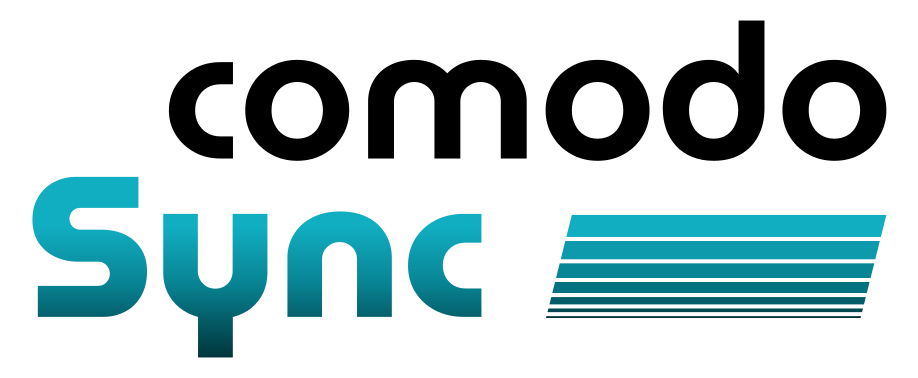

  

# COMODO Sync

Plugin nativo para **Unreal Engine 5.7** que permite la comunicación bidireccional con servidores OPC UA, utilizando la librería [open62541](https://www.open62541.org/).

Desarrollado como parte del proyecto **COMODO** para la creación de gemelos digitales. Se trata de una implementación mínima del protocolo para el funcionamiento del proyecto, incluyendo conexión al servidor, lectura y escritura de nodos, y suscripciones a cambios.

## Instalación

1.  Clona este repositorio en la carpeta `Plugins` de tu proyecto de Unreal Engine.
2.  Regenera los archivos del proyecto.
3.  Habilita el plugin en `Editar > Plugins`.

##  Uso Básico en Blueprints

1.  **Conectar**: Arrastra el nodo `Connect` o `Connect User` e introduce la dirección del servidor OPC UA.
2.  **Leer un Nodo**: Usa `Read Node Value` para obtener el valor actual de un nodo del servidor.
3.  **Escribir un Nodo**: Usa `Write Node Value` para enviar un nuevo valor al servidor.
4.  **Suscribirse a un Nodo**: Usa `Start Monitoring Node` para recibir actualizaciones automáticas cuando un valor cambie en el servidor.

> Para más detalles, consulta la [documentación completa](https://molivass.github.io/comodo-sync/)
